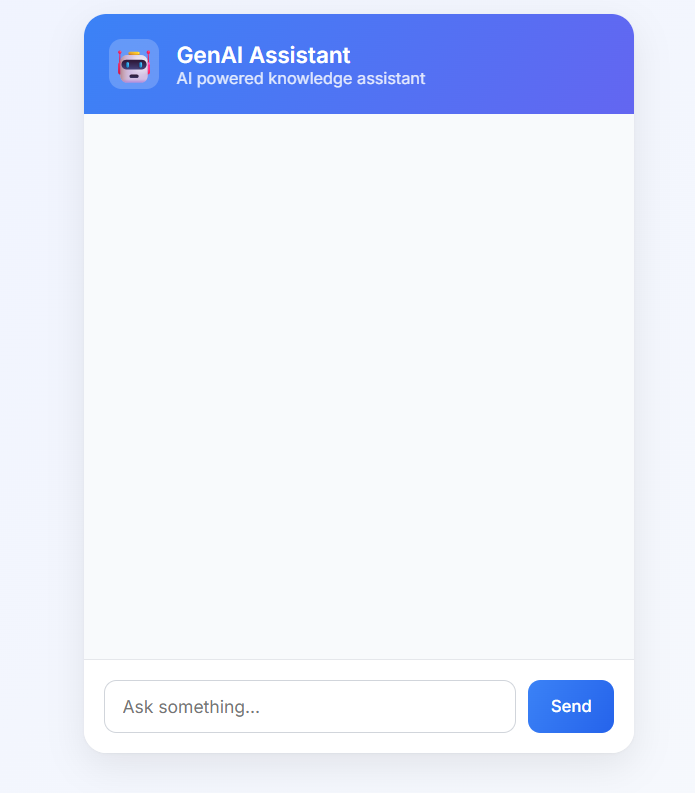
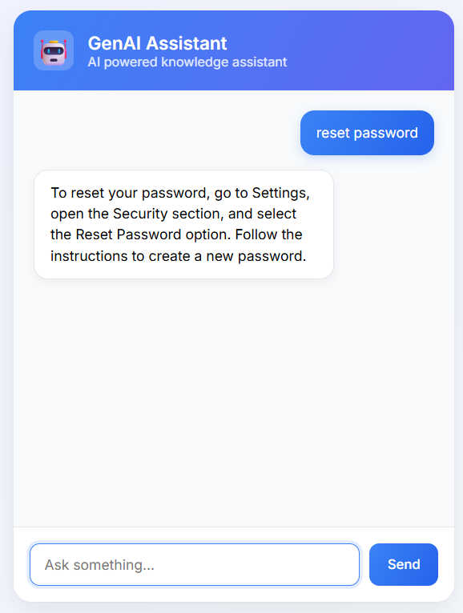
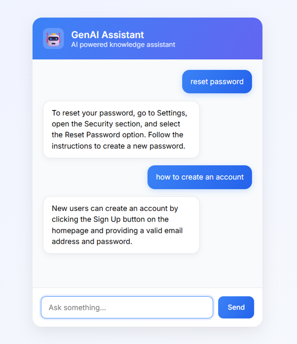

# GenAI RAG Chat Assistant 🤖

An AI-powered chatbot built using **Retrieval-Augmented Generation (RAG)** and the **Google Gemini API**.

The system retrieves relevant knowledge using **semantic search and embeddings** and generates responses using a **Large Language Model (LLM)**.

---

## 🚀 Features

- AI-powered question answering  
- Retrieval-Augmented Generation (RAG)  
- Semantic search using embeddings  
- Knowledge base stored in JSON documents  
- Fast similarity search using cosine similarity  
- Interactive chat interface  
- Flask backend  
- HTML, CSS, JavaScript frontend  
- Environment variables for API keys  

---

# 🏗 Architecture

System architecture flow:

User  
↓  
Web Interface (HTML / CSS / JS)  
↓  
Flask Backend API  
↓  
Query Embedding Generation  
↓  
Vector Similarity Search  
↓  
Retrieve Relevant Documents  
↓  
Prompt Construction  
↓  
Gemini LLM  
↓  
Generated Response  
↓  
Return Response to User

This architecture ensures responses are generated using **retrieved knowledge instead of relying only on model training data**.

---

# 🧠 RAG Workflow

The chatbot follows a **Retrieval-Augmented Generation pipeline**.

Step 1 — User Query  
User asks a question in the chat interface.

Step 2 — Query Embedding  
The system converts the question into a vector embedding.

Step 3 — Similarity Search  
The query embedding is compared with stored document embeddings.

Step 4 — Context Retrieval  
Top relevant document chunks are retrieved.

Step 5 — Prompt Construction  
Retrieved context is combined with the user query.

Step 6 — LLM Generation  
The prompt is sent to the Gemini model.

Step 7 — Response Delivery  
The generated answer is returned to the frontend.

---

# 📦 Embedding Strategy

Embeddings convert text into **numerical vectors representing semantic meaning**.

Process used:

1. Load documents from `docs.json`
2. Convert document text into embeddings
3. Store embeddings in `embeddings.json`
4. Convert user queries into embeddings
5. Compare query embeddings with stored embeddings

Benefits:

- Semantic search instead of keyword search  
- Improved retrieval accuracy  
- Reduced API usage through embedding caching  

---

# 🔎 Similarity Search

The system uses **Cosine Similarity**.

Formula:

similarity = cosine(query_vector, document_vector)

Process:

1. Generate embedding for user query  
2. Compare with stored embeddings  
3. Rank documents by similarity score  
4. Select top relevant results  
5. Send them as context to the LLM  

This allows retrieval of **semantically related information even when keywords differ**.

---

# 🧾 Prompt Design

Prompt design ensures the model uses retrieved knowledge.

Prompt structure:

You are an AI assistant.

Use the following context to answer the question.

Context:
{retrieved_documents}

Question:
{user_query}

Provide a clear and accurate answer.

Goals:

- Reduce hallucinations  
- Ground responses in retrieved knowledge  
- Improve answer accuracy  

---

## ⚙️ Installation

Follow these steps to run the project locally.

### 1️⃣ Clone the Repository

```bash
git clone https://github.com/Parthu-M/Production-Grade-GenAI-Assistant-with-RAG.git
cd genai-chat-assistant
```

### 2️⃣ Create a Virtual Environment

```bash
python -m venv .venv
```

### 3️⃣ Activate the Virtual Environment

**Windows**

```bash
.venv\Scripts\activate
```

**Mac / Linux**

```bash
source .venv/bin/activate
```

### 4️⃣ Install Dependencies

```bash
pip install -r requirements.txt
```

### 5️⃣ Add Your API Key

Create a `.env` file in the project root and add:

```env
GOOGLE_API_KEY=your_gemini_api_key_here
```

### 6️⃣ Run the Application

```bash
python app.py
```

### 7️⃣ Open in Browser

```
http://localhost:5000
```


# 📸 Screenshots

### Chat Interface



### AI Response Example





# 🎥 Demo Video

https://drive.google.com/file/d/11UBlM5wXYGWPIVS5RYQZl8R-mYj9akJO/view?usp=sharing

---

## 🛠 Technologies Used

### 🧠 Backend
- **Python**
- **Flask**
- **Google Gemini API**

### 🤖 AI Concepts
- **Retrieval-Augmented Generation (RAG)**
- **Vector Embeddings**
- **Cosine Similarity Search**

### 🎨 Frontend
- **HTML**
- **CSS**
- **JavaScript**  

---

# 📌 Example Use Cases

- AI customer support assistants  
- Knowledge base search  
- FAQ automation  
- Internal documentation search  
- Helpdesk AI tools  

---

# ⚠️ Notes

- Gemini free tier has API rate limits  
- Embeddings are cached locally  
- Never upload `.env` to GitHub  

---

# 🤖 Production-Grade GenAI Assistant with RAG

[](https://production-grade-genai-assistant-with-rag-41a7.onrender.com/)

An AI-powered chatbot using Retrieval-Augmented Generation (RAG) and Google Gemini.

# 👨‍💻 Author

Parthu M 