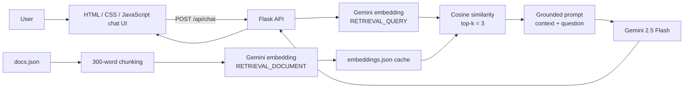
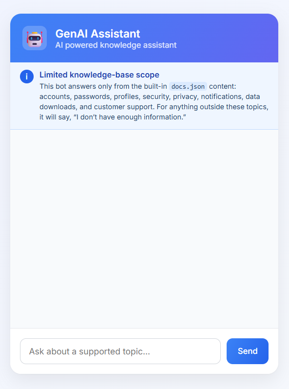
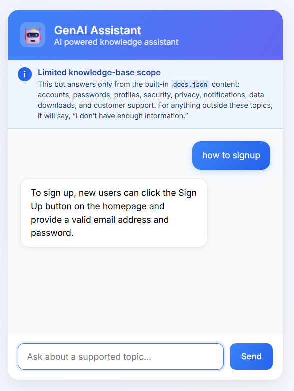
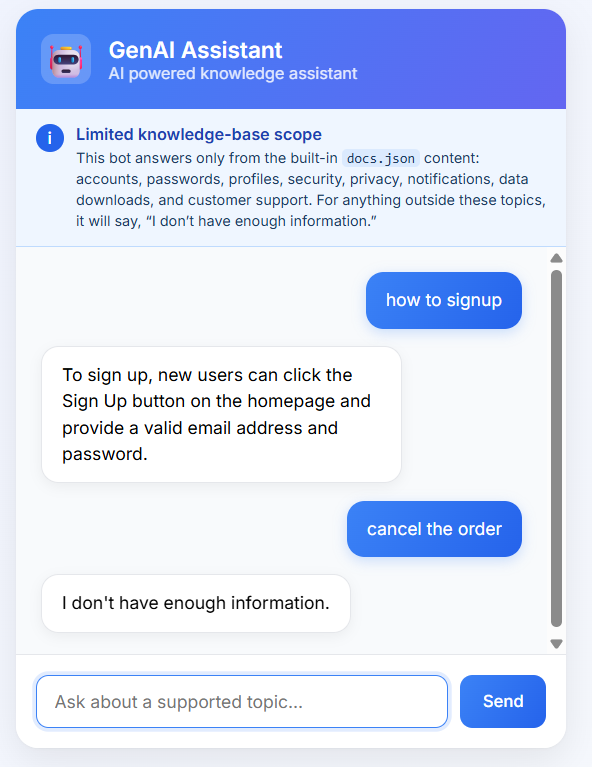

# Production-Grade GenAI Assistant with RAG

[](https://production-grade-genai-assistant-with-rag-41a7.onrender.com/)
[](https://www.python.org/)
[](https://flask.palletsprojects.com/)
[](https://ai.google.dev/)

A production-oriented, closed-book customer-support assistant that combines semantic retrieval with Google Gemini to generate answers grounded in a controlled knowledge base.

The project demonstrates the complete RAG lifecycle: document ingestion, chunking, task-specific embeddings, similarity search, prompt grounding, refusal behavior, a Flask API, and a responsive chat interface.

**[Try the live application](https://production-grade-genai-assistant-with-rag-41a7.onrender.com/)**

## Why this project matters

General-purpose language models can produce fluent answers even when the required facts are missing. This project reduces that risk by retrieving relevant information from a local knowledge base before generation and explicitly instructing the model to refuse unsupported questions.

### Engineering highlights

- **End-to-end RAG pipeline:** ingestion, chunking, embeddings, retrieval, context construction, and generation.
- **Task-aware embeddings:** documents use `RETRIEVAL_DOCUMENT`; user questions use `RETRIEVAL_QUERY`.
- **Bounded context:** cosine similarity ranks the corpus and sends only the top three chunks to the model.
- **Closed-book behavior:** Gemini is instructed to answer only from retrieved context and return a fallback when evidence is missing.
- **Embedding cache:** document vectors are written to `embeddings.json` and reused after the first run.
- **API-first design:** a JSON endpoint separates the retrieval/generation backend from the browser client.
- **Deployment-aware configuration:** secrets come from environment variables, and the server reads Render's dynamic `PORT`.
- **Responsive user experience:** message states, keyboard submission, loading feedback, error handling, and mobile styling.

## Architecture


```mermaid
flowchart LR
    U["User"] --> UI["HTML / CSS / JavaScript chat UI"]
    UI -->|POST /api/chat| API["Flask API"]
    API --> QE["Gemini embedding<br/>RETRIEVAL_QUERY"]

    KB["docs.json"] --> CH["300-word chunking"]
    CH --> DE["Gemini embedding<br/>RETRIEVAL_DOCUMENT"]
    DE --> CACHE["embeddings.json cache"]

    QE --> SEARCH["Cosine similarity<br/>top-k = 3"]
    CACHE --> SEARCH
    SEARCH --> PROMPT["Grounded prompt<br/>context + question"]
    PROMPT --> LLM["Gemini 2.5 Flash"]
    LLM --> API
    API --> UI
```

### Request lifecycle

1. On the first startup, the application loads `docs.json`, splits each document into chunks, creates document embeddings, and stores them locally.
2. A user submits a question through the browser.
3. Flask creates a query embedding with `gemini-embedding-001`.
4. The application compares the query vector with cached document vectors using cosine similarity.
5. The three highest-ranked chunks are combined into a compact context.
6. Gemini 2.5 Flash receives the context, the question, and a strict grounding instruction.
7. The API returns the generated reply and the number of retrieved chunks to the client.

## Demo knowledge boundary

> **Important:** This is intentionally a closed-book demo. Please ask only about subjects covered by [`docs.json`](docs.json). If the retrieved context does not contain the answer, the assistant is instructed to respond: **"I don't have enough information."**

The current knowledge base covers:

- Creating or permanently deleting an account
- Resetting or changing a password
- Changing the registered email address
- Updating profile information or a profile picture
- Enabling or disabling two-factor authentication
- Reviewing login activity or logging out from all devices
- Managing notification preferences
- Managing privacy and data-sharing settings
- Downloading account data
- Contacting customer support

Good questions to try:

- How do I reset my password?
- Where can I enable two-factor authentication?
- How do I review recent login activity?
- Can I log out from every device?
- Where can I download my account data?
- How can I contact customer support?

## Screenshots

| Chat interface | Grounded answer | Additional query |
| --- | --- | --- |
|  |  |  |

## Technology stack

| Layer | Technology | Responsibility |
| --- | --- | --- |
| Generation | Gemini 2.5 Flash | Produces a concise answer from retrieved context |
| Embeddings | `gemini-embedding-001` | Creates document and query vectors |
| Retrieval | NumPy + scikit-learn | Ranks chunks with cosine similarity |
| Backend | Python + Flask | Serves the UI and `/api/chat` endpoint |
| Knowledge store | JSON | Keeps the demo corpus readable and version-controlled |
| Cache | Local JSON | Avoids regenerating document embeddings on every startup |
| Frontend | HTML + CSS + JavaScript | Provides the responsive chat experience |
| Configuration | `python-dotenv` | Loads the Gemini API key locally |
| Hosting | Render-compatible runtime | Uses the platform-provided port |

## Run locally

### Prerequisites

- Python 3
- A [Google AI Studio API key](https://aistudio.google.com/app/apikey)

### Setup

```bash
git clone https://github.com/Parthu-M/Production-Grade-GenAI-Assistant-with-RAG.git
cd Production-Grade-GenAI-Assistant-with-RAG

python -m venv .venv
```

Activate the environment:

```powershell
# Windows PowerShell
.\.venv\Scripts\Activate.ps1
```

```bash
# macOS / Linux
source .venv/bin/activate
```

Install dependencies:

```bash
python -m pip install -r requirements.txt
```

Create a `.env` file in the repository root:

```env
GOOGLE_API_KEY=your_gemini_api_key
```

Start the application:

```bash
python app.py
```

Open [http://localhost:10000](http://localhost:10000). The first startup can take longer because the application creates and caches the knowledge-base embeddings.

## API contract

### `POST /api/chat`

Request:

```json
{
  "message": "How do I enable two-factor authentication?"
}
```

Successful response:

```json
{
  "reply": "For additional security, go to Settings, select Security, and activate the 2FA option.",
  "retrievedChunks": 3
}
```

Validation error:

```json
{
  "error": "Message required"
}
```

Example request:

```bash
curl -X POST http://localhost:10000/api/chat \
  -H "Content-Type: application/json" \
  -d '{"message":"How do I reset my password?"}'
```

## Project structure

```text
.
|-- app.py                 # Ingestion, retrieval, generation, and Flask routes
|-- docs.json              # Version-controlled support knowledge base
|-- requirements.txt       # Python dependencies
|-- templates/
|   `-- index.html         # Chat page
|-- static/
|   |-- script.js          # Client-side chat behavior and API calls
|   `-- styles.css         # Responsive interface styling
`-- screenshots/           # README product previews
```

`embeddings.json` is generated at runtime and intentionally excluded from Git.

## Updating the knowledge base

Add entries to `docs.json` using the existing structure:

```json
{
  "title": "Article title",
  "content": "The factual content available to the assistant."
}
```

The current cache is not automatically invalidated when `docs.json` changes. After editing the corpus:

1. Delete the generated `embeddings.json` file.
2. Restart the application.
3. The application will regenerate embeddings for the updated knowledge base.

## Current safeguards and trade-offs

| Area | Current implementation | Production hardening opportunity |
| --- | --- | --- |
| Grounding | Prompt instructs the model to use only retrieved context | Add a similarity threshold and deterministic refusal before generation |
| Retrieval | In-memory cosine search over top three fixed-size chunks | Add metadata filters, reranking, and a managed vector database |
| Explainability | Grounded context is supplied to the model | Return document titles, citations, and retrieval scores |
| Evaluation | Behavior can be checked with the included support questions | Add a versioned evaluation set for retrieval recall, faithfulness, and latency |
| Operations | Environment-based secrets and cached embeddings | Add structured logs, tracing, metrics, retries, and health checks |
| Security | API key remains server-side | Add authentication, rate limiting, input limits, and abuse controls |
| Serving | Flask application with platform port support | Use a production WSGI server, containerization, and CI/CD |

These boundaries are documented deliberately: the repository is an end-to-end RAG implementation and a clear foundation for production hardening, not a claim that every enterprise control is already present.

## Author

**Parthu M** — [GitHub profile](https://github.com/Parthu-M)
